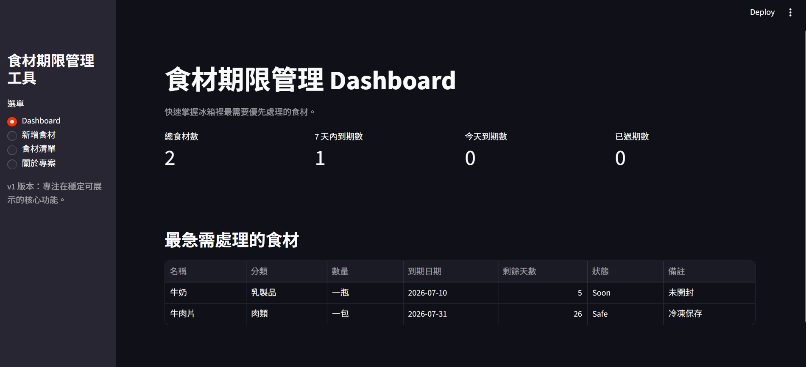
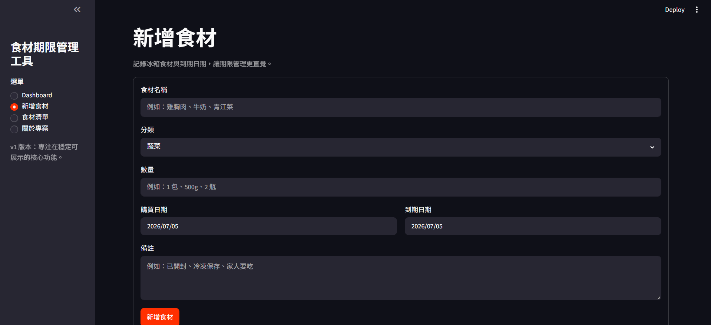
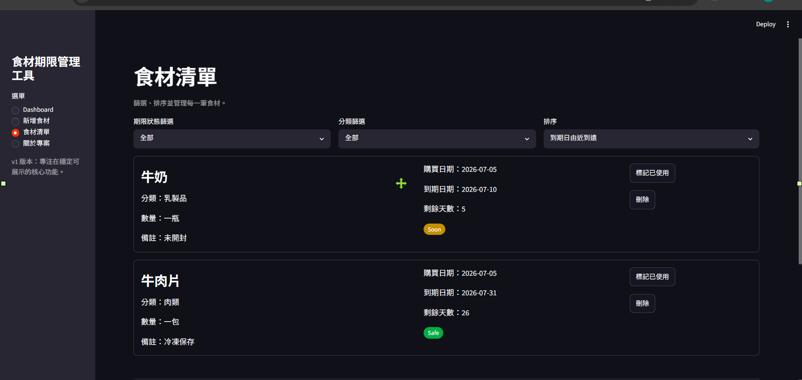

# fridge-expiry-tracker

一個使用 Python、Streamlit 與 SQLite 製作的食材期限管理工具。使用者可以新增冰箱裡的食材、設定到期日期，系統會自動計算剩餘天數，並標示即將過期、今天到期、已過期與已使用的食材。

這是 v1 版本，重點是完成穩定、清楚、可展示的核心功能。LINE 通知、OCR 與料理建議等延伸功能先保留在 Roadmap。

## 專案動機

冰箱裡的食材常常因為忘記保存期限而浪費。這個專案希望用簡單的資料記錄、期限計算與總覽頁，幫助使用者快速掌握哪些食材需要優先處理。

對作品集來說，這個專案也可以展示：

- 使用 Streamlit 建立可互動的資料管理介面
- 使用 SQLite 做本機資料保存
- 將 UI、資料庫操作與商業邏輯拆分成不同模組
- 控制 v1 功能範圍，先完成可用版本再規劃進階功能

## 功能特色

- 新增食材名稱、分類、數量、購買日期、到期日期與備註
- 使用 SQLite 儲存資料，資料庫位於 `data/fridge.db`
- 程式啟動時自動建立資料庫與 `foods` 資料表
- 自動計算剩餘天數 `days_left`
- 依規則顯示 `Used`、`Expired`、`Today`、`Soon`、`Safe` 狀態標籤
- 期限總覽顯示總食材數、7 天內到期數、今天到期數、已過期數
- 顯示最急需處理的食材清單
- 支援期限狀態篩選、分類篩選與排序
- 支援標記已使用與刪除食材
- 繁體中文介面，適合作為初學者作品集專案

## Demo Screenshots

### 期限總覽



### 新增食材



### 食材清單



## 使用技術

- Python
- Streamlit
- pandas
- SQLite `sqlite3`

## 專案架構

```text
fridge-expiry-tracker/
├── app.py
├── README.md
├── requirements.txt
├── .gitignore
├── data/
│   └── .gitkeep
├── src/
│   ├── __init__.py
│   ├── database.py
│   ├── food_manager.py
│   └── utils.py
├── sample_data/
│   └── sample_foods.csv
└── assets/
    └── screenshots/
        ├── .gitkeep
        ├── add-food.png
        ├── food-list.png
        └── overview.png
```

## 安裝方式

建議在專案資料夾中建立虛擬環境後再安裝套件。

```bash
pip install -r requirements.txt
```

## 執行方式

在專案資料夾中執行：

```bash
streamlit run app.py
```

啟動後，Streamlit 會在瀏覽器開啟本機服務。程式第一次執行時會自動建立：

```text
data/fridge.db
```

`data/fridge.db` 是使用者本機資料，已加入 `.gitignore`，不會提交到 GitHub。

## 資料欄位說明

資料表名稱：`foods`

| 欄位 | 型態 | 說明 |
| --- | --- | --- |
| id | INTEGER | 食材流水號 |
| name | TEXT | 食材名稱，必填 |
| category | TEXT | 食材分類 |
| quantity | TEXT | 數量，例如 1 包、500g、2 瓶 |
| purchase_date | TEXT | 購買日期，格式為 YYYY-MM-DD |
| expiry_date | TEXT | 到期日期，格式為 YYYY-MM-DD，必填 |
| note | TEXT | 備註 |
| status | TEXT | 食材狀態，可為 `active` 或 `used` |
| created_at | TEXT | 建立時間 |

## 狀態標籤說明

`days_left` 的計算方式：

```text
expiry_date - today
```

| 標籤 | 規則 |
| --- | --- |
| Used | 食材已標記為已使用 |
| Expired | `days_left < 0` |
| Today | `days_left == 0` |
| Soon | `0 < days_left <= 7` |
| Safe | `days_left > 7` |

## 使用方式

1. 開啟 Streamlit App。
2. 到「新增食材」頁面輸入食材資料。
3. 到「期限總覽」查看期限統計與最急需處理清單。
4. 到「食材清單」使用篩選與排序功能管理資料。
5. 食材用完後可標記為已使用。
6. 不需要保留的資料可以刪除。

## 已測試項目

- 新增食材資料
- 顯示期限總覽統計
- 顯示食材清單
- 顯示剩餘天數與狀態標籤
- 期限狀態篩選
- 分類篩選
- 到期日排序
- 標記已使用
- 刪除食材
- SQLite 資料表自動建立

## 專案限制

- v1 僅支援本機 SQLite，不包含多人同步或雲端資料庫。
- 沒有登入系統，適合個人本機使用。
- 日期需要手動輸入，尚未支援 OCR 辨識包裝日期。
- 尚未加入通知功能，因此需要使用者主動開啟 App 查看。
- 目前以功能完整與穩定展示為主，尚未加入自動化測試。

## Roadmap

- [x] 食材新增與期限管理
- [x] 期限總覽統計
- [x] 食材篩選與排序
- [x] 標記已使用 / 刪除食材
- [ ] LINE Messaging API 每日提醒
- [ ] OCR 辨識食品包裝上的有效日期
- [ ] 根據即將過期食材產生料理建議
- [ ] PWA / App 版本

## 面試時可以說明的重點

- 這個專案不是只做靜態畫面，而是有 SQLite 資料保存與實際 CRUD 操作。
- 將 Streamlit UI、資料庫操作、期限計算與共用工具拆分到不同檔案，讓程式比較容易維護。
- 使用 `days_left` 衍生欄位串起總覽統計、狀態標籤、篩選與排序。
- v1 有明確的功能邊界，先完成食材期限管理，再把通知、OCR、料理建議放入後續規劃。
- 專案規模適合初學者作品集，能清楚說明需求拆解、資料表設計與功能實作流程。
